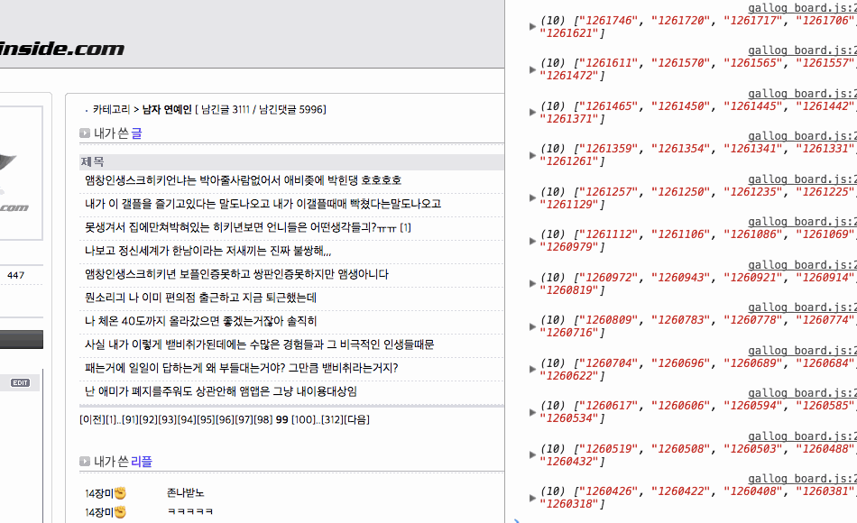
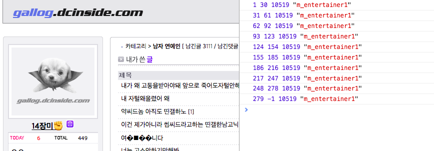
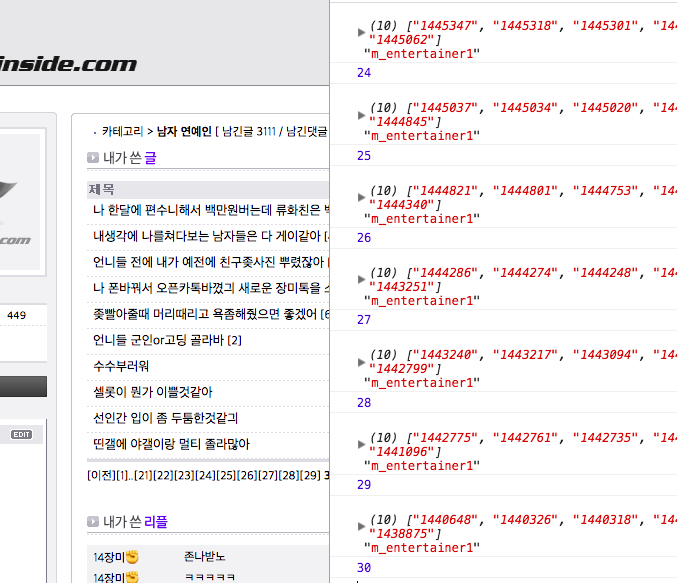
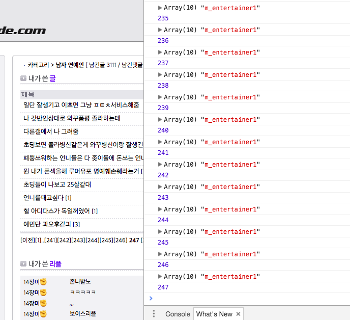
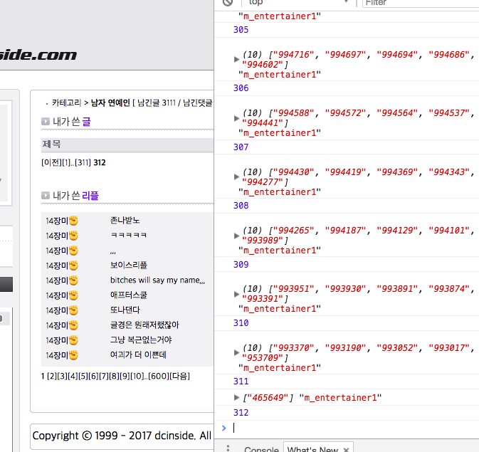
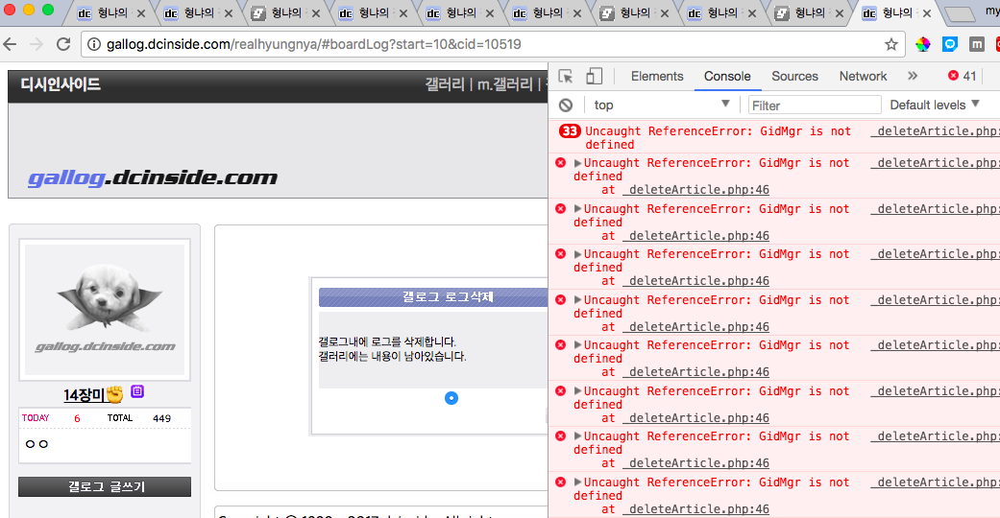
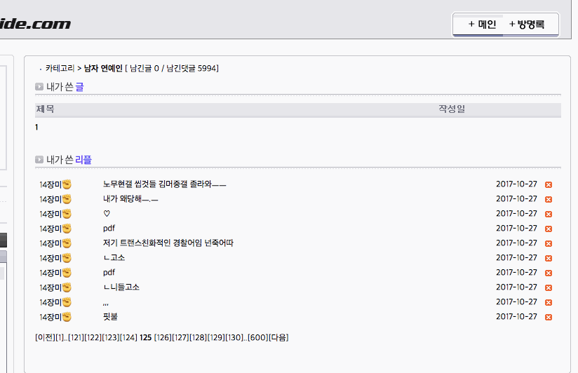
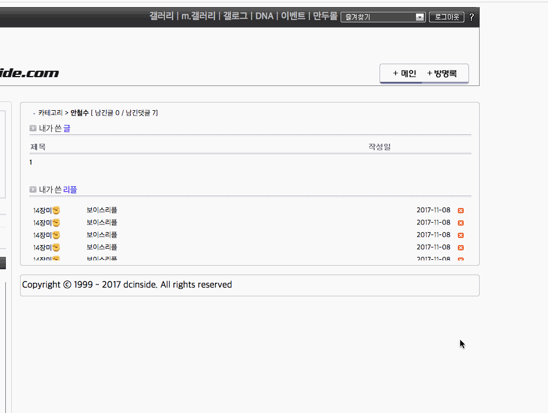
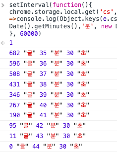

# 서치 데모

# 멀티 스레딩 형식의 검색 속도 향상
> 크롬 탭을 다중 스레드 대체재로 활용 이 점은 각각의 스레드가 주어진 업무를 병렬로 수행

# 프로세서 별 페이지 분기 검색
> start, last, cid, gallery URI

# 수행 결과
> 3000글의 수행 결과 10~12초

# 갤로그 삭제 데모

# 다중 스레드를 활용한 병렬 업무 처리

# 수행 결과
> 대략 2분 내외

# 덧글 서치 데모

# 갤로그 덧글 삭제

# 갤러리 덧글 삭제

# 갤러리 글 삭제 분단위 테스트
> 대략 682글 삭제 기준  
> 35분 ~ 43분  
> Mac Air RAM 4GB

### 고마운 갤러들
##### 테스트 계정 제공자 14장미님에게 감사함을 전합니다.